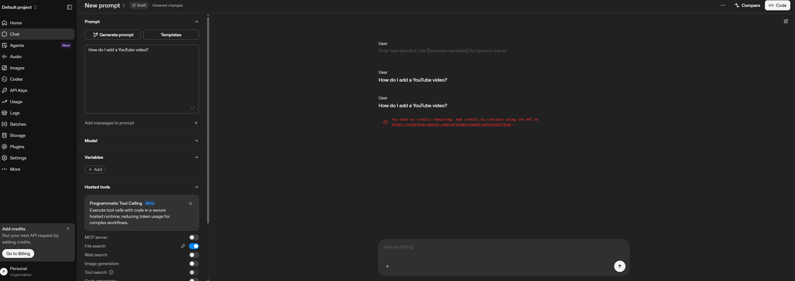

# OptiSigns AI Assistant

Help-center ingest + grounded chat for OptiSigns support articles.

## Setup

```bash
python -m venv .venv
# Windows: .venv\Scripts\activate
# macOS/Linux: source .venv/bin/activate
pip install -r requirements.txt
cp .env.sample .env
# Set API_KEY (Gemini) and/or OPEN_AI_API_KEY, plus store IDs — see .env.sample
```

## Run locally

```bash
# One-shot ingest (scrape help center → vector/file search store), then exit
python main.py

# Optional: API server for chat / HTTP ingest
uvicorn app:app --reload --port 8080
```

API examples (server running):

```bash
# Rescrape / ingest (starts in background, returns 202)
curl -X POST "http://localhost:8080/api/v1/ingest" \
  -H "Content-Type: application/json" \
  -H "X-API-Key: $SERVICE_API_KEY" \
  -d '{"provider":"openai"}'

# Ingest status
curl "http://localhost:8080/api/v1/ingest/status" \
  -H "X-API-Key: $SERVICE_API_KEY"

# Chat
curl -X POST "http://localhost:8080/api/v1/chat" \
  -H "Content-Type: application/json" \
  -H "X-API-Key: $SERVICE_API_KEY" \
  -d '{"message":"How do I add a YouTube video?"}'
```

## Deployed API

Cloud Run service `ai-assisstant` (`asia-southeast1`):

`https://ai-assisstant-228150331350.asia-southeast1.run.app`

Send `X-API-Key` on `/api/v1/ingest`, `/api/v1/ingest/status`, and `/api/v1/chat`. The value below is for demonstration only. Rotate it in Secret Manager (`AI_ASSISTANT_ENV` → `SERVICE_API_KEY`); Cloud Run reads that secret at `/secrets/.env`.

```bash
# Demo key — change anytime in Secret Manager
SERVICE_API_KEY=12gVG3232vqvDVEWg32gvwe
BASE_URL=https://ai-assisstant-228150331350.asia-southeast1.run.app

# Chat
curl -X POST "$BASE_URL/api/v1/chat" \
  -H "Content-Type: application/json" \
  -H "X-API-Key: $SERVICE_API_KEY" \
  -d '{"message":"How do I add a YouTube video?"}'

# Ingest status
curl "$BASE_URL/api/v1/ingest/status" \
  -H "X-API-Key: $SERVICE_API_KEY"
```

## Docker (one-shot job)

Default image command is `python main.py` (runs once, exits `0` on success):

```bash
docker build -t ai-assistant .
docker run --rm \
  -e API_KEY=your_gemini_key \
  -e INGEST_PROVIDER=gemini \
  -e GEMINI_FILE_SEARCH_STORE_NAME=fileSearchStores/... \
  -e HELP_CENTER_BASE_URL=https://support.optisigns.com \
  ai-assistant
```

## Daily job logs

Cloud Scheduler triggers daily ingest on Cloud Run service `ai-assisstant` (`asia-southeast1`).

- [Cloud Scheduler — daily job](https://console.cloud.google.com/cloudscheduler?referrer=search&authuser=1&project=project-199e43ec-f249-44ed-af3)
- [Cloud Run logs — ai-assisstant](https://console.cloud.google.com/run/detail/asia-southeast1/ai-assisstant/logs?project=project-199e43ec-f249-44ed-af3)
- Look for: `INGEST_STARTED`, `INGEST_SUMMARY`, `INGEST_FINISHED`

## Sample assistant answer

Question: *How do I add a YouTube video?*

The assistant cannot answer this question right now. Both OpenAI and Gemini reject the request because the accounts have no credits remaining.

OpenAI returns `credit_balance_exhausted` (`insufficient_quota`). The Playground and `POST /api/v1/chat` show:

> You have no credits remaining. Add credits to continue using the API at https://platform.openai.com/settings/organization/billing/.

Gemini fails for the same reason: the API key has no remaining credits, so grounded chat stays blocked until billing is topped up on both providers.


