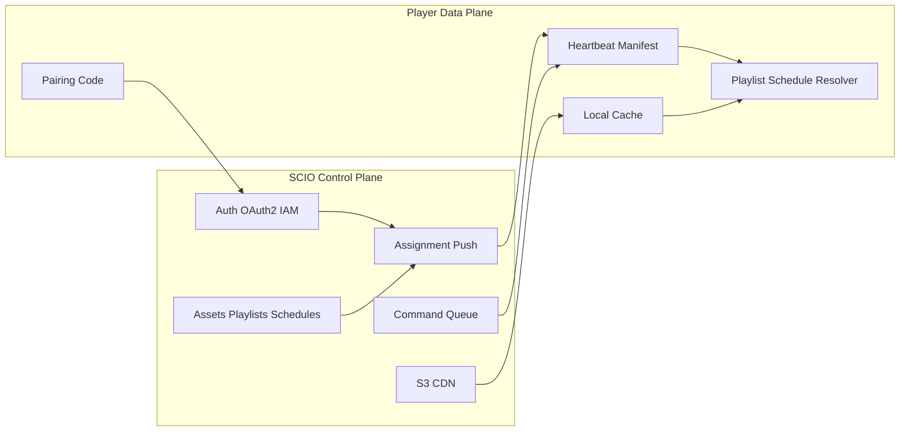
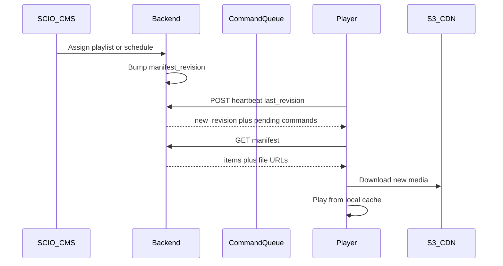
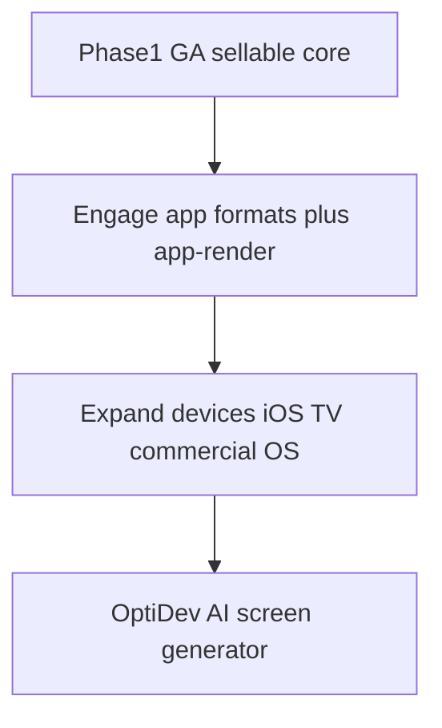

# SCIO Clone — Engineering Plan

**Audience:** Engineering team and stakeholders  
**Purpose:** Align on what we build, in what order, how long it takes, and why — before implementation starts.  
**Product references:** [app.optisigns.com](https://app.optisigns.com), [support.optisigns.com](https://support.optisigns.com), [webplayer.optisigns.com](https://webplayer.optisigns.com), [docs.optisigns.com](https://docs.optisigns.com), [optisigns.com](https://www.optisigns.com).

---

## 1. Product summary

OptiSigns turns any screen — restaurant menu board, retail window, office lobby, mall directory — into a managed digital sign. **SCIO** is the cloud management portal operators use day to day: [app.optisigns.com](https://app.optisigns.com). Players (native apps, OptiSigns hardware, or the **Web Player** at [webplayer.optisigns.com](https://webplayer.optisigns.com)) run on the displays. The product promise is straightforward: control *what* a screen shows, *when*, in *what layout*, and *how the device behaves* — from one dashboard, across many locations.

The customer journey matches the [Getting Started guide](https://support.optisigns.com/hc/en-us/articles/18823504383891-OptiSigns-Getting-Started-Guide):

1. Launch a player → note the **pairing code**.
2. In SCIO, **Add / New Screen** → enter the code → Paired.
3. Upload media under **Files / Assets**.
4. Optionally build a **Playlist** (ordered assets + durations) or a calendar **Schedule**.
5. **Edit Screen** and bind Type = Asset | Playlist | Schedule — or **Push to Screens**.

Beyond that core loop, OptiSigns also sells **interactive** and **AI-built** experiences:

| Layer | CMS surface | What customers get |
|---|---|---|
| **Core signage (Phase 1)** | Screens, Assets, Playlists, Schedules | Passive images/video on paired displays |
| **Engage (Phase 2)** | [engageManagement](https://app.optisigns.com/app/engageManagement) | Touchscreen/QR **app formats** (kiosk designer, content library kiosk, kiosk lite) — player **app-renders**, not slideshow-only |
| **OptiDev (Phase 2)** | OptiDev tab / [optidev.ai](https://www.optidev.ai/) | AI agent generates a custom web app → publish as a screen asset |

### How Engage differs from playlists

| Engage format | Behavior |
|---|---|
| **Kiosk Designer Pro** | Multi-page touch UI with Link actions to URLs/assets; attract screen while idle |
| **Kiosk Lite** | Ads play until touch → open website |
| **Content Library Kiosk** | Asset folder tree → browsable touch catalog |
| **QR Overlay / Scan-to-Interact** | QR-driven interaction |

Same assign/push pipeline as media; different **player runtime** (touch, webview, navigation).

---

## 2. Release strategy

| | **Phase 1 — Core CMS (sellable)** | **Phase 2 — Advanced** |
|---|---|---|
| Goal | Ship a basic digital signage product customers can buy and run | Differentiate with interactive apps, more devices, AI-built screens |
| In scope | Auth (OAuth 2.0) + IAM → Screens + sync (Web Player + Android) → File assets (S3) → Playlists → Schedules | Engage app formats + app-render on player → expand devices (iOS, smart TV / commercial OS, …) → OptiDev AI builder |
| Out of scope | Engage, OptiDev, wide device matrix, Teams ACL depth, Sync Play, Proof of Play, 140+ apps | Full OptiSigns parity still not required |
| Duration | **~6 months** | **~6–9 months** after Phase 1 GA (depends on Engage depth and device count) |
| Team | ~5.5–6 FTE | Same core team; add player capacity when expanding OS matrix |

### Is Phase 1 enough to sell?

**Yes — for classic digital signage.** Pair screens, upload media, run playlists and schedules (menus, lobby ads, store promos, office announcements). That matches how most OptiSigns customers start.

**Not yet selling in Phase 1:** interactive kiosks (Engage), AI-generated custom screen apps (OptiDev), or “any device” coverage. Those become Phase 2 upsell / expansion.

**Phase 1 success criteria:** Web Player + Android pair and sync → upload files to S3 → playlist → schedule (device-local TZ) → content updates via heartbeat/poll → offline play of cached media → seat licenses + basic IAM.

---

## 3. Architecture

SCIO is the **control plane**. Every player is a **thick data-plane client**. The server owns tenants, content graphs, assignment state, licenses, and command queues. The player owns local clock, playlist/schedule resolution, cache, and (in Phase 2) app-render for Engage/OptiDev content.

### Domain model (Phase 1)

- **Account** → users, roles (Owner / Admin / User), seat quota.
- **Screen / Device** → pairing, tags, orientation, poll/heartbeat intervals, `current_type` ∈ {ASSET, PLAYLIST, SCHEDULE}, `manifest_revision`, last_seen.
- **Asset** → file objects in S3 (+ optional Website URL type).
- **Playlist** → ordered file assets + duration.
- **Schedule** → calendar events, recurrence, device-local TZ, default content, overlap rules.
- **RemoteCommand** → reboot, screenshot, identify, refresh (queued).

### Player sync protocol (Phase 1 and beyond)

| Channel | Mechanism | Purpose |
|---|---|---|
| Primary | HTTPS heartbeat + poll for `manifest_revision` | Assignment changes, commands, presence |
| Media | CDN/S3 download after manifest lists new files | Images, video, docs |
| Commands | Server queue drained on heartbeat | Reboot, screenshot, identify |
| Optional | SSE/WebSocket | CMS live device list only |

**Defaults (configurable):** heartbeat ~60s; content poll ~2–5 minutes for cached slideshows. Operators can tighten for faster Save → screen updates.

---

## 4. Phase 1 — Core CMS timeline (~6 months)

**Build order (intentional):** IAM first, then a live screen path, then media, then composition, then time-based automation.

### Team (~5.5–6 FTE)

| Role | FTE | Owns |
|---|---|---|
| Backend A (senior) | 1 | Auth/OAuth2/IAM, devices, assignment, schedules, commands |
| Backend B | 1 | S3 assets, playlists, manifests, licenses |
| CMS frontend | 1 | Auth UI, Screens, Assets, Playlists, Schedules |
| Player | 1 | Web Player + Android sync/playback |
| Full-stack | 1 | Push/tags UX, CMS polish, Website URL asset |
| DevOps + PM/design | 0.5 + 0.5 | CI/CD, staging, packaging for sale |

### Sequence

| Step | Focus | Deliverables | Exit criteria |
|---|---|---|---|
| **1. Auth + IAM** | Identity | OAuth 2.0 (authorization code + refresh for CMS; client credentials or device tokens for players), accounts, Owner/Admin/User roles, invite users | Users can sign in; roles enforced on APIs |
| **2. Screens + sync** | Device loop | Pairing codes, screen registry, heartbeat/poll, revisioned manifest stub, Web Player + Android pair and stay online | Pair web + Android → CMS shows Online; soft assign placeholder works |
| **3. File assets + S3** | Media | Upload API, S3 storage, CDN signed URLs, asset library UI, assign single asset to screen, local cache download | Upload image/video → assign → both players show it offline-capable |
| **4. Playlists** | Composition | Playlist CRUD, ordered items + duration, assign playlist, player sequential play + prefetch | 3-item playlist rotates on both platforms |
| **5. Schedules** | Automation | Calendar UI, recurrence, **device-local TZ**, overlaps (one-time > recurring; else last-updated), default content, Live/Expire; tags + push-by-tag; seat licenses; harden for GA | Multi-location “10–11 AM” correct; product ready to sell |

### Month mapping (indicative)

| Month | Milestone |
|---|---|
| 1–1.5 | Auth/OAuth2/IAM + project scaffolding |
| 1.5–3 | Screens + Web Player + Android sync (pairing, heartbeat, manifest) |
| 3–4 | File assets + S3 + single-asset assign |
| 4–5 | Playlists + player playback state machine |
| 5–6 | Schedules, tags/push, licenses, QA, sellable GA |

### Phase 1 effort summary

| Capability | BE person-weeks | Player person-weeks |
|---|---|---|
| Auth + OAuth 2.0 + IAM | 4–5 | 1 (token handling) |
| Screens + pairing + sync protocol | 5–6 | 6–8 (Web + Android) |
| File assets + S3 + CDN | 4–5 | 3 (download/cache) |
| Playlists + assignment | 4 | 3–4 |
| Schedules + TZ + push/tags + licenses + harden | 8–10 | 3–4 |
| **Subtotal** | **~25–30** | **~16–20** | Plus CMS FE in parallel |

### Phase 1 definition of done (sellable)

- [ ] OAuth 2.0 sign-in; Owner/Admin/User IAM enforced.
- [ ] Web Player and Android pair via code; heartbeat shows Online/Offline.
- [ ] Upload files to S3; assign asset; players download and cache.
- [ ] Playlists with durations; assign and play on both platforms.
- [ ] Schedules with device-local TZ, defaults (no black screen), recurrence.
- [ ] Push/assign by screen or tag; seat license limit on pair.
- [ ] Offline: cached playlist continues; reconnect picks up new revision.
- [ ] Basic remote commands (refresh / identify; reboot/screenshot where platform allows).
- [ ] Pricing/packaging and known-limitations list (no Engage, no OptiDev, limited OS).

---

## 5. Phase 2 — Advanced (~6–9 months after Phase 1 GA)

Phase 2 turns the product from “managed slideshow” into “interactive + AI + more hardware,” in this order:

### 5.1 Engage — app formats + app-render on screen (~3–4 months)

| Work | Detail |
|---|---|
| CMS | Engage Management UI: create Kiosk Lite, Content Library Kiosk, then Kiosk Designer Pro (links, attract screen) |
| Asset model | New content types: interactive app config JSON + linked assets/URLs |
| Player | **App-render runtime**: touch events, webview for URLs, navigation stack, idle timeout → attract/playlist, preload |
| Platforms first | Web Player (pointer) + Android (touch) — required before iOS/TV for Engage QA |
| Monetization | Engage-tier or add-on packaging |

**Exit:** Touch Android stick runs Content Library Kiosk or Kiosk Lite; idle → interact → return to idle.

### 5.2 Expand devices (~2–3 months, overlaps Engage polish)

| Target | Why |
|---|---|
| iOS / Apple TV (as supported) | Broader retail/office install base |
| Smart TV / commercial (e.g. webOS, Tizen, Fire — pick by demand) | “Any screen” marketing |
| Windows / ChromeOS (if not started in Phase 1) | Desktop and education |

Reuse the **same** heartbeat/manifest/app-render contract; ship per-OS capability profiles (touch, storage, webview limits).

### 5.3 OptiDev — AI agent for customized screens (~3–4 months)

| Work | Detail |
|---|---|
| Builder | Chat agent plans + generates a hosted web app (component UI) |
| Hosting | Deploy generated app; version/publish |
| Integration | **Publish to SCIO** → save as asset → assign/push to screens (same pipeline as Website/Engage URL apps) |
| Billing | AI credits + runtime/cloud credits (or simplified v1 of that model) |
| Security | Private publish path; scoped API keys between builder and CMS |

**Exit:** Prompt → generated app → assign to Android/Web Player screen without manual Designer work.

### Phase 2 definition of done

- [ ] At least two Engage formats live (e.g. Kiosk Lite + Content Library Kiosk); Designer Pro if schedule allows.
- [ ] Players app-render interactive content (touch + webview), not media-only.
- [ ] ≥1 additional OS beyond Web + Android in GA or public beta.
- [ ] OptiDev: generate → publish → screen plays; commercial packaging defined.
- [ ] Phase 1 playlist/schedule path remains stable (no regressions).

### Still later / optional after Phase 2

Teams + folder ACL, Content Tag Rules, Sync Play, Proof of Play, Drive/Dropbox sync, Video Wall, SSO/on-prem, public GraphQL at partner scale, 140+ catalog apps.

---

## 6. Backend workstreams (by phase)

| Subsystem | Phase 1 | Phase 2 |
|---|---|---|
| OAuth 2.0 + IAM | Required | Extend for OptiDev/Engage roles |
| Screens + sync | Required (Web + Android) | More OS clients |
| S3 assets | Required | Shared by Engage/OptiDev assets |
| Playlists / schedules | Required | Unchanged core |
| Command queue | Basic | MDM richness per device |
| Engage app config + app-render | — | Required |
| OptiDev agent + hosting + publish | — | Required |
| Public GraphQL | Optional late P1 / early P2 | Partner surface |

---

## 7. Risks and hard problems

1. **Device-local schedule TZ** — “10 AM” is per device OS time ([Schedules](https://support.optisigns.com/hc/en-us/articles/360016981853-Creating-and-Using-Schedules-with-OptiSigns)); empty slots need default content.
2. **Offline cache** — Phase 1 promise for file playlists; Engage/OptiDev web apps need different offline rules.
3. **Large media on S3** — signed URLs, progress, eviction, optional download windows.
4. **Android + Web parity** — one manifest contract; capability flags where platforms differ.
5. **Phase 2 app-render** — touch + webview security (sandbox), attract/idle state machine, performance on cheap sticks.
6. **OptiDev cost** — LLM + hosting credits; isolate billing so Phase 1 margins stay clear.
7. **Device expansion** — each OS is a product surface (store review, auto-start, storage limits); prioritize by sales demand.

---

## 8. One thing found in the product that was not expected

**What was unexpected:** Digging past the Getting Started loop (pair → upload → playlist → schedule), the CMS is not only a media slideshow manager. Under **Engage** ([engageManagement](https://app.optisigns.com/app/engageManagement)), content formats behave like **apps** — touchscreen kiosks, content-library browsers, QR-driven flows — which need an **app-render runtime** on the player, not just image/video playback. On top of that, **OptiDev** adds an **AI chatbot/agent** that generates customized screen apps and publishes them into the same assign/push pipeline. That depth is easy to miss if you only walk the basic Files / Playlists / Screens path.

**What it changed in the plan:** Trying to ship core CMS + Engage app-render + AI codegen + many device OS targets in one release would delay a **sale-ready** product and blur what customers are buying. The plan was therefore **split into two phases**:

| Phase | Focus | Why |
|---|---|---|
| **Phase 1** | Auth/IAM, screen sync (Web Player + Android), S3 assets, playlists, schedules | Enough for production rollout and selling classic digital signage |
| **Phase 2** | Engage app formats + app-render, then more devices, then OptiDev AI | Advanced differentiation after revenue and the player sync contract are proven |

So the unexpected complexity of **app screens** and **AI-built screens** is exactly why Phase 1 stays lean and Phase 2 exists — better for go-to-market, not because those features are unimportant.

---

## 9. Executive summary

| Phase | Outcome | When |
|---|---|---|
| **Phase 1** | Sellable core CMS: OAuth2/IAM → screens sync (Web Player + Android) → S3 assets → playlists → schedules | **~6 months** |
| **Phase 2** | Engage interactive app formats + app-render → more devices (iOS, TV, …) → OptiDev AI screen generator | **~6–9 months** after Phase 1 |

Phase 1 is enough to **roll out and sell** classic digital signage. Phase 2 is the growth path for kiosks, broader hardware, and AI-customized screens — without blocking the first revenue release.
